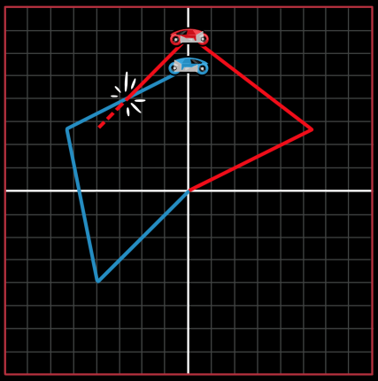
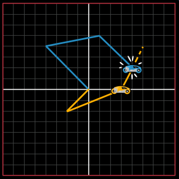

# Bem-vindo(a) ao Vectrun!

 Um jogo inspirado em "Tron: Legacy", onde os jogadores são transportados para um mundo digital semelhante ao Grid do filme. Cada jogador controla uma moto de luz e enfrenta desafios emocionantes que envolvem o uso estratégico de vetores no plano cartesiano.

Os jogadores podem usar Cartas de Vetores para planejar seus movimentos no Grid e criar trajetórias de luz. Assim como no filme, a colisão com as linhas de luz de outros jogadores é uma parte crucial do jogo. Quando um jogador colide com a linha de luz de outro, ele perde e suas linhas de luz são apagadas.

O objetivo do jogo é usar habilidades de geometria analítica para criar trajetórias inteligentes, evitando colisões com as paredes e as linhas de luz de outros jogadores. Isso não apenas cria um ambiente emocionante, mas também ajuda os jogadores a entenderem conceitos de matemática de maneira lúdica e prática.

Portanto, o jogo inspirado em "Tron: Legacy" combina elementos emocionantes do filme com o ensino lúdico de vetores e geometria analítica, proporcionando uma experiência educativa e divertida ao mesmo tempo.

# Descrição do Jogo

## The Grid

O jogo possui o modo The Grid, onde todos os jogadores disputam entre si dentro de uma arena, o objetivo é ser o último sobrevivente.

1. As Cartas de Vetores são embaralhadas automaticamente. Cada jogador recebe 3 cartas de vetores, e elas são exibidas apenas para o próprio jogador, mantendo-se ocultas dos outros participantes. As cartas restantes são armazenadas em uma pilha.
2. As motos dos jogadores começam na origem do plano cartesiano, no ponto (0, 0)
3. Cada jogador está autorizado a usar uma Carta de Vetor por jogada para realizar um movimento. Esse movimento deve ser executado de acordo com uma das 3 Cartas de Vetores disponíveis.
4. Após a realização do movimento, o jogo marca o deslocamento no tabuleiro com uma linha. A carta utilizada é automaticamente descartada, e uma nova carta é retirada da pilha de Cartas de Vetores.
5. O jogo continua com cada jogador realizando seus movimentos. Em algum momento no jogo, uma das seguintes Ações Críticas poderá ocorrer: 

|                                                                                                                                                    |                                                                                                                   |                 |
|:--------------------------------------------------------------------------------------------------------------------------------------------------------------------------------------------------------:|:------------------------------------------------------------------------------------------------------------------------------------------------------------------------:|:------------------------------------------------------------------------:|
|                                                                                       Colisão com Paredes Laterais                                                                                       |                                                                           Interseção com linha                                                                           |                           Interseção com moto                            |
| Caso isso aconteça, o jogador em questão perde e suas linhas de luz são apagadas. É importante observar que, para que a batida na parede seja válida, o vetor escolhido deve conduzir para fora do mapa. | Neste caso, se um jogador colidir com a linha de outro jogador, ele perde e a linha é apagada. Além disso, se o jogador colidir com sua própria linha, ele também perde. | Neste caso, ambos os jogadores perdem e têm suas linhas de luz apagadas. |

## Requisitos

- Python 3
- Pygame (instalado via `pip install pygame`)

## Como Executar

1. Clone este repositório em sua máquina local

2. Navegue até o diretório do jogo

3. Execute o jogo

## Créditos

- Idealizado por Tulio.
- Desenvolvido por Beatriz, Gustavo e Henzo.

